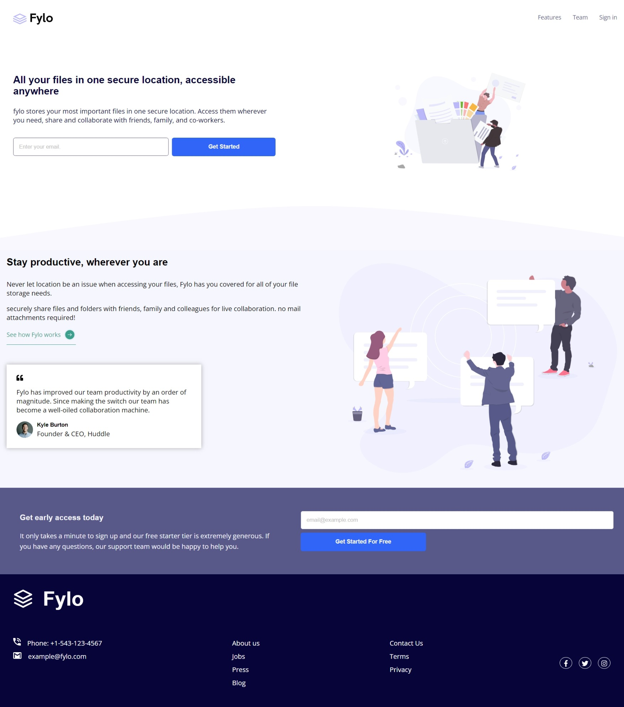

# Frontend Mentor - Fylo landing page with two column layout solution

This is a solution to the [Fylo landing page with two column layout challenge on Frontend Mentor](https://www.frontendmentor.io/challenges/fylo-landing-page-with-two-column-layout-5ca5ef041e82137ec91a50f5). Frontend Mentor challenges help you improve your coding skills by building realistic projects.

## Table of contents

- [Overview](#overview)
  - [The challenge](#the-challenge)
  - [Screenshot](#screenshot)
  - [Links](#links)
- [My process](#my-process)
  - [Built with](#built-with)
  - [What I learned](#what-i-learned)

## Overview

### The challenge

Users should be able to:

- View the optimal layout for the site depending on their device's screen size
- See hover states for all interactive elements on the page

### Screenshot

### Links

- Live Site URL: [Live Preview](https://github.com/Islam-foda/Frontend-mentor-lap/blob/main/fylo-landing-page-with-two-column-layout-master/index.html)

## My process

### Built with

- Semantic HTML5 markup
- CSS custom properties
- Flexbox
- CSS Grid
- Mobile-first workflow
- [React](https://reactjs.org/) - JS library
- [React-Icons](https://react-icons.github.io/react-icons/) - React Icons

### What I learned

- Using Flex box to made it easy to control elements over the page.

- React Training on component.

- Git and github training.
